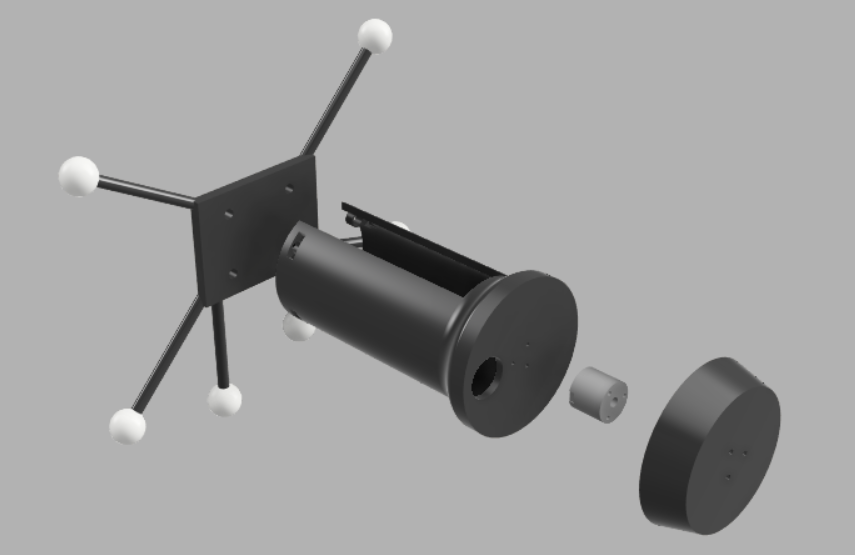
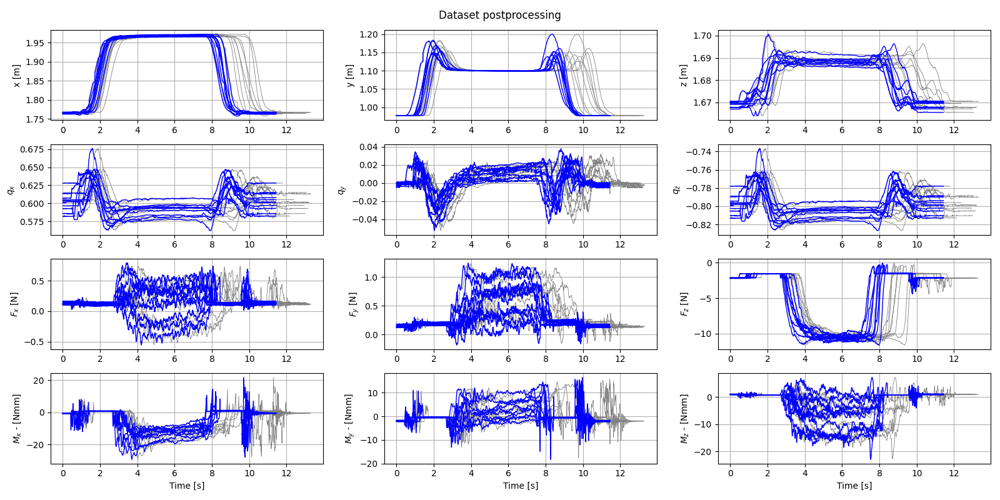

# CoLeCT - Control and Learning of Contact Transitions

This repository contains the code for the CoLeCT project. The project is an end-to-end learning-from-demonstration framework that covers:

* Recording demonstrations of trajectories defined by poses and force profiles.
* Post-processing the recorded demonstrations using Soft-DTW to temporally align them.
* Probabilistic modeling of the demonstration database using Gaussian Mixture Models (GMMs) and Gaussian Mixture Regression (GMR).
* Learning the probabilistic features of the trajectories using Kernelized Movement Primitives (KMP).
* Uncertainty-aware controller gain computation using a Linear-Quadratic Regulator (LQR).
* Reproduction on an UR5e robotic manipulator with a parallel position/force controller.

## Table of contents

- [CoLeCT - Control and Learning of Contact Transitions](#colect---control-and-learning-of-contact-transitions)
  * [Setup](#setup)
  * [TODO](#TODO)
  * [Demonstration recording](#demonstration-recording)
  * [Dataset postprocessing](#dataset-postprocessing)
    + [Dataset creation](#dataset-creation)
    + [Trimming and pose interpolation](#trimming-and-pose-interpolation)
    + [Temporal alignment with Soft-DTW](#temporal-alignment-with-soft-dtw)
    + [Coordinate shift](#coordinate-shift)
  * [Learning from demonstration](#learning-from-demonstration)
    + [GMM/GMR](#gmmgmr)
    + [KMP](#kmp)
  * [Reproduction](#reproduction)
    + [LQR](#lqr)
    + [Parallel position/force controller](#parallel-positionforce-controller)

## Setup

The package requirements for the project are listed in [requirements.txt](https://github.com/lbusellato/colect/blob/main/requirements.txt). It is highly suggested to use a Python3 virtual environment, which can be set up as follows:

    python3 -m venv colect-venv
    source colect-venv/bin/activate
    python3 -m pip install -r requirements.txt
    source colect-venv/bin/activate

To use the demonstration recording pipeline, an OptiTrack camera system with Motive version 2.x is needed.

To use the reproduction pipeline on UR5 robots, a real-time kernel and the SDU ur_rtde library are needed. To enable real-time capabilities on Ubuntu follow [this guide](https://sdurobotics.gitlab.io/ur_rtde/guides/guides.html#linux). To install the library follow [this guide](https://sdurobotics.gitlab.io/ur_rtde/installation/installation.html).

## TODO

* #FEATURE KMP w/ null-space projector
* #FEATURE Threaded LQR gain computation
* #FEATURE Hyperparameter tuning for GMM, GMR and KMP
* #ENHANCEMENT Recording both robot base and handheld tool at the same time, making the coordinate shift part of the recording instead of the postprocessing
* #ENHANCEMENT Motive server IP autodiscovery

## Demonstration recording

The demonstration recording part of the framework was built around a custom-made handheld recording tool. 

<p align="center">
  
</p>

The tool has six OptiTrack markers used for recording the position and orientation, and a Wittenstein HEX12 6DOF force/torque sensor mounted on the end-effector.

Demonstration recording is handled by the Recorder class. A sample usage can be found in [samples/demonstration_recording.py](https://github.com/lbusellato/colect/blob/main/requirements.txt). 

The pipeline for demonstration recording is as follows:

* Prepare the workspace:
  * Place at least three OptiTrack markers around the base of the robot. This is done to record the position of the base frame of the robot. 
  * Place the handheld tool into the workspace.
  * Connect the force sensor to the system running the code.
* In Motive:
  * Select all the markers on the robot base and create a new rigid body from them. 
  * Select all the markers of the handheld tool and create a new rigid body from them.
  * In the *Streaming* tab, set the *Local Interface* to the machine's external IP and set *Transmission Type* to *Unicast*.
  * In the *Assets* tab, deselect all rigid bodies except the one you want to record.
* Demonstration recording:
  * Create an instance of the Recorder class, supplying as argument the same IP address you set in Motive.
  * Start the execution by calling Recorder.run().
  * Press 'r' + ENTER to start the recording. Press 's' + ENTER to stop the recording. Press 'q' + ENTER to quit.

Besides the trajectory recording with the handheld tool, a recording must be made of the rigid body placed on the robot base, so that the trajectory coordinates can be converted to the robot base frame.

Recordings are saved in .csv format in the recordings folder. In principle, the recording step can be done with other methods, as long as the produced .csv file has the header:

    timestamp,pos_x,pos_y,pos_z,quat_x,quat_y,quat_z,quat_w,force_x,force_y,force_z,torque_x,torque_y,torque_z

Where *pos_N* are the three cartesian coordinates, *quat_N* are the four components of the orientation expressed in quaternion form, *force_N* are the three components of the force and *torque_N* are the three components of the torque.
  
## Dataset postprocessing

All the following steps are showcased in the [samples/dataset_postprocessing.py](samples/dataset_postprocessing.py) script.

### Dataset creation

The trajectory recording should be placed within the same directory and given an identifying name. For instance, the single point task the recordings are named 'single_point_task_NN.csv', where NN is a progressive identifying number. This is because all functions for dataset postprocessing identify the files they need using regex strings.

The first step is to convert the .csv files into .npy files. The create_dataset() function does just that, taking as arguments the path of the directory holding the demonstration, relative to the project root, and the regex string used for matching the demonstration files. In the example of the single point task, the regex is:

    r'single_point_task(\d{2})\.csv'

The function then processes each .csv file, collecting all the rows into a list which is then saved as a .npy file in the same directory as the demonstrations. Besides the data contained in the recordings, the function also computes the Euclidean-space projection of the quaternions, which will be useful later.

### Trimming and pose interpolation

Since the force/torque sensor has a sampling frequency of 1kHz and the camera system has a frame rate of 120Hz, the recordings have many rows where the pose is empty. This was done in order to keep as many force recordings as possible, so that high-frequency force profiles can be used.

Therefore a trim_datasets() function is implemented, which removes any pose-empty rows at the beginning and end of each recording. 

After trimming, the interpolate_datasets() function should be called, in order to fill the remaining pose-empty rows by linearly interpolating the positions and slerping the quaternions of the filled rows that precede and follow them.

### Temporal alignment with Soft-DTW

To be used with the rest of the framework, the demonstrations need to all be the same length. To achieve this, a Soft-DTW procedure is implemented in the align_datasets() function. The function uses as a reference for computing the soft-alignment path the pose of the first demonstration.

The results for the single point task are shown in the following plots:

<p align="center">
  
</p>

In grey are plotted the original demonstrations, all with different durations (i.e. lengths). In blue the dataset soft-aligned with DTW, with the demonstrations having now all the same duration, but still preserving a comparable variance.

### Coordinate shift

To allow reproduction, the dataset must be converted to the relevant reference frame of the robot that carries out the reproduction. In our case, this was the base frame of an UR5e manipulator. The to_base_frame() function carries out this step, taking as arguments the path of the dataset and the path of the recording of the base frame. The function shifts the coordinates of the recordings from Motive's origin to the base frame origin, and rotates the recorded quaternions accordingly. It also takes care of recomputing the Euclidean-space projections of the quaternions.

## Learning from demonstration

All the following steps are showcased in the [samples/kmp.py](samples/kmp.py) script.

### GMM/GMR

A probabilistic description of the dataset is obtained by initializing a Gaussian Mixture Model and fitting it to the data using Expectation-Maximization. Then a probabilistic reference trajectory is extracted using Gaussian Mixture Regression. 

For example, to initialize a time-driven model for learning positions, you must set:
* The number of Gaussian components. This is an hyperparameter that should be tuned.
* The input dataset, in this case time. This is just a timestamp associated to each point in the dataset.
* The output dataset, in this case the positions contained in the original dataset. Time derivatives of the positions should be computed and added to the training dataset.

Even when not using a time-driven model (e.g. for learning force profiles), time derivatives should still be added to the training dataset. This is because the kernel function of KMP expects them.

The initialization of the GMM model and the prediction step of GMR are carried out by the fit() function.

### KMP

The probabilistic features of the reference trajectories are learned with Kernelized Movement Primitives.

The model is set up by choosing a number of hyperparameters, which should be tuned:
* l : The regularization factor for the mean and covariance minimization problems
* alpha : Coefficient for the covariance prediction
* sigma_f : Coefficient for the kernel function

The model is trained with the fit() function, which computes the estimator matrix used for prediction. The function takes as arguments:
* X : The input dataset, which will be the same used to train the GMM
* mu : The mean of the GMR trajectory
* sigma : The covariance of the GMR trajectory

Once the model is trained, the predict() method can be used to make new predictions. In the sample code for instance, the predict method is applied to a time series more dense than the one used for training. The method can, in principle, also make predictions outside of the time series used for training.

## Reproduction

### LQR

### Parallel position/force controller

## References


#### [1] Kernelized Movement Primitives
[[Link to publication]](https://www.researchgate.net/publication/319349682_Kernelized_Movement_Primitives)
```
@Article{Huang19IJRR,
  Title = {Kernelized Movement Primitives},
  Author = {Huang, Y. and Rozo, L. and Silv\'erio, J. and Caldwell, D. G.},
  Journal = {International Journal of Robotics Research},
  Year = {2019},
  Volume={38},
  Number={7},
  Pages = {833--852},
}
```

#### [2] Generalized Orientation Learning in Robot Task Space
[[Link to publication]](https://www.researchgate.net/publication/330675655_Generalized_Orientation_Learning_in_Robot_Task_Space)
```
@InProceedings{Huang19ICRA_2,
   Title = {Generalized Orientation Learning in Robot Task Space},
   Author = {Huang, Y. and Abu-Dakka, F. and Silv\'erio, J. and Caldwell, D. G.},
   Booktitle = {Proc. {IEEE} International Conference on Robotics and Automation ({ICRA})},　　　　
   Year = {2019},
   Address = {Montreal, Canada},
   Month = {May},
   Pages = {2531--2537}
 }
```


#### [3] Uncertainty-Aware Imitation Learning using Kernelized Movement Primitives.
[[Link to publication]](https://www.researchgate.net/publication/334884378_Uncertainty-Aware_Imitation_Learning_using_Kernelized_Movement_Primitives)
```
@inproceedings{inproceedings,
author = {Silvério, João and Huang, Yanlong and Abu-Dakka, Fares and Rozo, Leonel and Caldwell, Darwin},
year = {2019},
month = {11},
pages = {},
title = {Uncertainty-Aware Imitation Learning using Kernelized Movement Primitives},
doi = {10.1109/IROS40897.2019.8967996}
}
```
